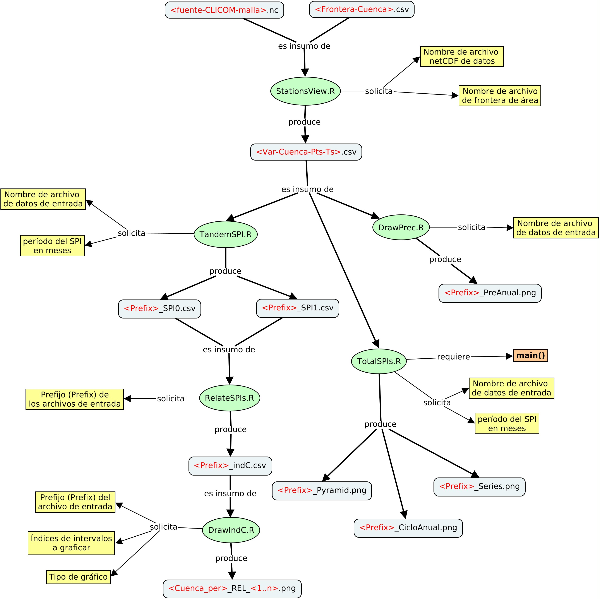

# INTRO
En este documento doy algunas pistas de cómo generar la información del  
proyecto.

# PRODUCCIÓN DE LA INFORMACIÓN
En seguida se muestra el diagrama de flujo de la información, hasta llegar 
a los _mapas_ con la relación de cambio del SPI entre dos períodos para una 
región dada.

**Figura 1.** Flujo de la información (como un mapa conceptual)

En esta figura se muestran los programas con sus respectivas entradas y salidas principales. En seguida 
se procede a explicar cada uno de los programas.

## StationsView.R

Este programa tiene como entrada dos archivos con información, a saber:

1. **\<fuente-CLICOM-malla\>.nc**. Es un archivo en formato netCDF que contiene la descripción malla de alguna de las variables
climáticas: precipitación, temaperatura máxima, o temperatura mínima, en el territorio nacional. En este caso se trata del 
desarrollo que hiciera el CICESE con datos de la base de datos CLICOM, administrada por el Servicio Meteorológico Nacional.

2. **\<Frontera-Cuenca\>.csv**. Descripción de la frontera de la cuenca (o alguna región especifica), en formato CSV. La tabla 
debe contener por lo menos dos columnas: una etiquetada con el texto "Lon", y la otra, con el texto "Lat", que corresponden 
a las coordenadas geográficas, Longitud y Latitud, respectivamente.

El programa entrega como salida un único archivo:

* **\<Var-Cuenca-Pts-Ts\>.csv**. Es un archivo, cuyas columnas son las series de tiempo de cada uno de los puntos (de malla), 
contenidos en la región descrita por la frontera de la cuenca (o área) provista, el primero y segundo renglón de cada una 
de la columnas contiene las coordenadas geográficas del punto correspondiente a la columna y a partir del tercer renglón 
se registran, en orden, cada uno de los valores de la variable hasta finalizar las series de tiempo.

