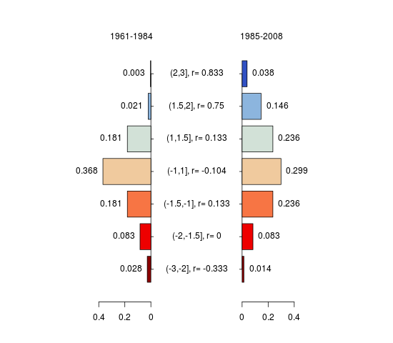
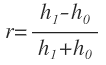
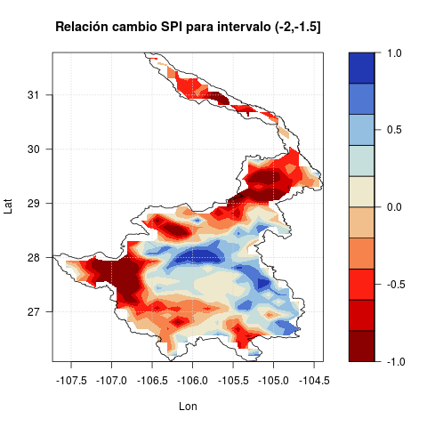
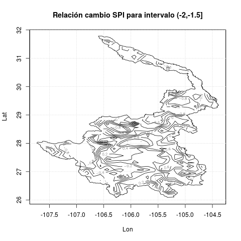

# INTRO
En este documento doy algunas pistas de cómo generar la información del  
proyecto.

# PRODUCCIÓN DE LA INFORMACIÓN
En seguida se muestra el diagrama de flujo de la información, hasta llegar 
a los _mapas_ con la relación de cambio del SPI entre dos períodos para una 
región dada.

**Figura 1.** Flujo de la información (como un mapa conceptual)

En esta figura se muestran los programas con sus respectivas entradas y salidas principales. En seguida 
se procede a explicar cada uno de los programas.

## 1 StationsView.R

### 1.1 Objetivo

Este programa tiene como objetivo digerir cualquiera de archivos NetCDF que contienen la información de la malla de CLICOM
producida para obtener recortes de la información en un formato más legible, CSV en este caso.

### 1.2 Entradas

Este programa tiene como entrada dos archivos con información, a saber:

1. **\<fuente-CLICOM-malla\>.nc**. Es un archivo en formato netCDF que contiene la descripción malla de alguna de las variables
climáticas: precipitación, temaperatura máxima, o temperatura mínima, en el territorio nacional. En este caso se trata del 
desarrollo que hiciera el CICESE con datos de la base de datos CLICOM, administrada por el Servicio Meteorológico Nacional.

2. **\<Frontera-Cuenca\>.csv**. Descripción de la frontera de la cuenca (o alguna región especifica), en formato CSV. La tabla 
debe contener por lo menos dos columnas: una etiquetada con el texto "Lon", y la otra, con el texto "Lat", que corresponden 
a las coordenadas geográficas, Longitud y Latitud, respectivamente.

### 1.3 Salidas

El programa entrega como salida un único archivo:

* **\<Var-Cuenca-Pts-Ts\>.csv**. Es un archivo, cuyas columnas son las series de tiempo de cada uno de los puntos (de malla), 
contenidos en la región descrita por la frontera de la cuenca (o área) provista, el primero y segundo renglón de cada una 
de la columnas contiene las coordenadas geográficas del punto correspondiente a la columna y a partir del tercer renglón 
se registran, en orden, cada uno de los valores de la variable hasta finalizar las series de tiempo. Un ejemplo de este tipo 
de archivo es el archivo, contenido en este repositorio, es ConchosPRE_mm.csv.

### 1.4 Funcionamiento

Al inicio del programa pregunta interactivamente por el nombre del archivo netCDF que se desea procesar. 
Dicho archivo, contiene la variable en cuestión como un *hiper*cubo, a lo largo de tres dimensiones, en
este caso, la longitud, la latitud, y el tiempo. Así, la primer tarea de este programa es *desdoblar* esa información como una
tabla con n *columnas*, la longitud, la latitud, y cada uno de los valores de variable a lo largo del tiempo, esto es, para 
cada uno de los puntos de la malla, en el renglón se anotan la longitud, la latitud y toda la serie de tiempo de la variable
para ese punto. La segunda tarea es conservar de los puntos solamente los que se encuentran dentro del
área especificada como límite. El resultado de estas operaciones, que consiste en la transposición de la tabla descrita 
antes, se entrega como se ha mencionado en la salida \<Var-Cuenca-Pts-Ts\>.csv.

## 2 TandemSPI.R

### 2.1 Objetivo

A partir de una tabla de series de tiempo de precipitaciones mensuales, para un conjunto de puntos y que se apega al formato 
CSV descrito como la salida \<Var-Cuenca-Pts-Ts\>.csv, en la sección 1.3, produce, para una partición de la serie de tiempo 
original en dos series, dos tablas que contienen series de tiempo de los SPIs calculados para cada punto, así como los datos para la producción de histogramas de densidad de probabilidades para cada una de las series de tiempo de SPIs.

### 2.2 Entradas

El programa tiene como entrada un único archivo:

* **\<Var-Cuenca-Pts-Ts\>.csv**. Este archivo se apega al formato descrito en la sección 1.3; sin embargo, no se trata de 
cualquiera de los archivos que salen de esa estapa, sino espicíficamente de archivos de precipitación con datos mensuales durante 
algún período de varios años. Un ejemplo de este tipo de archivo es el archivo, contenido en este repositorio, es 
ConchosPRE_mm.csv.

### 2.3 Salidas

El programa tiene como salida dos archivos, a saber:

1. **\<Prefix\>\_SPI0.csv**. Este archivo contine la primera mitad de la serie de tiempo de los SPIs calculados, así como los 
datos para la construcción del correspondiente histograma. Un ejemplo de este tipo de archivo es el archivo, contenido en este repositorio, es ConchosPRE_mm_SPI0.csv.

2. **\<Prefix\>\_SPI1.csv**. Este archivo contine la segunda mitad de la serie de tiempo de los SPIs calculados, así como los 
datos para la construcción del correspondiente histograma. Un ejemplo de este tipo de archivo es el archivo, contenido en este repositorio, es ConchosPRE_mm_SPI1.csv.

### 2.4 Funcionamiento

Al inicio, el programa pregunta interactivamente por el archivo que contiene los datos, esta información sirve no sólo para 
abrir el archivo en cuestión, sino para construír los nombres de los archivos de salida. Posteriormente, el programa pregunta 
también por el período en meses, en que se promedian los valores de precipitación previos cada mes. Típicamente, el archivo de 
entrada es alguno de los que se han producido como salida en la etapa descrita en la sección 1.3. El archivo contiene, 
como columnas, series mensuales de precipitación para un conjunto de puntos, cuyas coordenadas geográficas también se reportan como las dos primeras entradas de cada columna. Las series de tiempo son las mismas para todos los puntos considerados, así que de aquí 
en adelante se denominará únicamente como _la serie de tiempo_.   

La serie de tiempo, entonces, se particiona en dos subseries de tal manera que cada una de ellas consista en un número exacto e 
igual de años completos. Los meses sobrantes, que se considerarán al principio de la serie original, podrán ser utilizados de 
todas maneras para el cálculo de los promedios previos requeridos en la determinación de los SPIs.

Para el cálculo de los SPIs, se consideran las dos subseries consecutivas, como si fuera una sola serie y se calculan por medio 
de funciones modificadas para su cálculo a partir del código desarrollado por Joseph Wheatley (Biospherica, March 2010: 
http://joewheatley.net/2010/03/). El resultado es una tabla con las series de tiempo mensuales para cada uno de los puntos 
considerados. Esta tabla se particiona por la mitad, de acuerdo con las subseries de tiempo definidas previamente.

Finalmente, se hace una estadistica a las subseries de tiempo, para producir histogramas de densidad de probabilidades para 
los intervalos definidos por la _World Meteorological Organization_, para este índice, cuyas fronteras son: -3, -2, -1.5, 
-1, 1, 1.5, 2, 3.

Los archivos de salida contienen, para cada punto, la subserie de tiempo con los valores de los SPIs obtenidos, y al final, 
los valores para reproducir el histograma de densidad de probabilidades en cada caso.

## 3 RelateSPIs.R

### 3.1 Objetivo

Este programa toma dos conjuntos de subseries de tiempo _paralelas_ en cuanto a un conjunto de puntos considerados en alguna region
dada, de SPIs para dos períodos consecutivos, y los histogramas asociados con cada una de las subseries, con el propósito de compararlos mediante un índice que relaciona los valores en los histogramas.

### 3.2 Entradas

El programa tiene como entrada dos archivos, a saber:

1. **\<Prefix\>\_SPI0.csv**. Este archivo contine la primera mitad de la serie de tiempo de los SPIs calculados, así como los 
datos para la construcción del correspondiente histograma.  Un ejemplo de este tipo de archivo es el archivo, contenido en este repositorio, es ConchosPRE_mm_SPI0.csv.

2. **\<Prefix\>\_SPI1.csv**. Este archivo contine la segunda mitad de la serie de tiempo de los SPIs calculados, así como los 
datos para la construcción del correspondiente histograma.  Un ejemplo de este tipo de archivo es el archivo, contenido en este repositorio, es ConchosPRE_mm_SPI1.csv.

### 3.3 Salidas

El programa tiene como salida un único archivo:

* **\<Prefix\>\_indC.csv**. Contiene la tabla de índides comparativos entre los dos períodos de tiempo considerados. Para cada 
punto, cuyas coordenadas también se reportan, la tabla contiene los índices compartativos para cada intervalo de histograma, 
entre las densidades de un período y el otro. La definición del índice se muestra abajo, en la sección 3.4.  Un ejemplo de este tipo de archivo es el archivo, contenido en este repositorio, es ConchosPRE_mm_indC.csv.

### 3.4 Funcionamiento

Inicialmente el programa pregunta por el prefijo (Prefix) de los dos archivos que se van a considerar. 
Estos dos archivos de entrada, contienen subseries de tiempo de los SPIs para cada punto, y, al final de cada subserie, un análsis 
estadístico consistente en los datos para la construcción de histogramas de densidad de probabilidades, para los dos períodos 
y los intervalos definidos en la sección 2.4. Gráficamente, para un sólo punto, los dos histogramas se pudieran representar en 
el gráfico tipo espejo, con los histogramas en disposición vertical en vez de horizontal, que se muestra en la Fig. 2, 
y donde en vez de representar el ancho de las barras a escala, simplemente se señalan los intervalos mediante el texto
"(Inf,Sup]" que forma parte de las etiquetas centrales del gráfico.

**Figura 2.** Histogramas comparativos de dos períodos

Dada la construcción de los SPIs como elementos de una distribución normal estandarizada, y ya que los dos histogramas 
mencionados antes provienen de esa distribución, para cada intervalo, la suma de las alturas de las barras de los períodos a lo largo de todos los puntos considerados, es la misma. Por ejemplo, si se considera el intervalo central, en la Fig. 2, la suma de las _alturas_ de las barras en este caso es 0.368 + 0.299 = 0.667, y ese valor se mantiene constante para para todos los puntos considerados. Con esto en mente, para cada intervalo de los histogramas, definimos el siguiente índice:

  

donde, _h__0_, representa la altura de la barra del histograma del primer período y _h__1_, 
representa la altura de la barra del histograma del segundo período. En la Fig. 2, el valor del índice _r_ para 
cada intervalo de los histogramas, se muestra también en las etiquetas centrales de la figura.

Puesto que el programa cuenta con los dos histogramas para cada uno de los puntos dentro de la región considerada, el cálculo 
de los índices _r_, para todos los intervalos de cada par de histogramas, se efectúa para todos los puntos y se obtiene una 
tabla con los índices, que se guarda en el archivo de salida \<Prefix\>\_indC.csv, descrito antes el la sección 3.3.

De acuerdo con la construcción del índice, _r_, sus valores estarán acotados entre -1 y 1, de tal manera que si el índice es 
negativo, se estaría indicando una preponderancia del primer período sobre el segundo, mientras que si es positivo, se estaría 
señalando una preponderancia del segundo período sobre el primero; finalmente, si el índice es 0, se estaría mostrando que el
comportamiento de los dos períodos es esencialmente el mismo.

## 4 DrawIndC.R

### 4.1 Objetivo

Una vez que se han obtenido los índices comparativos, _r_, para todos los puntos del área considerada, esos valores para un 
intervalo dado se pueden graficar, mediante un código de colores, en un mapa representativo de la región; ese es el objetivo 
del presente programa.

### 4.2 Entradas

El programa tiene como entrada un único archivo:

* **\<Prefix\>\_indC.csv**. Contiene la tabla de índides comparativos entre los dos períodos de tiempo considerados. Para cada 
punto, cuyas coordenadas también se reportan, la tabla contiene los índices compartativos para cada intervalo de histograma, 
entre las densidades de un período y el otro. La definición del índice se ha indicado en la sección 3.4. Un ejemplo de este tipo de archivo es el archivo, contenido en este repositorio, es ConchosPRE_mm_indC.csv.

### 4.3 Salidas

El programa tiene como salida un conjunto de archivos:

* **\<Cuenca\>\_REL\_\<1..n\>.png**. De 1 a _n_ archivos gráficos, cada uno de los cuales contiene un mapa en el que se, 
mediante un código de colores, se representan los valores del índice comparativo de SPIs para dos períodos, en la región dada.
La escala de colores representa valores entre -1 y 1. Habrá tantos archivos de éstos como intervalos se hayan definido 
para los histogramas de SPIs. Un ejemplo de este tipo de archivo es el archivo, contenido en este repositorio, es Conchos_REL_3.csv.

### 4.4 Funcionamiento

Al inicio, este programa pregunta por el prefijo (Prefix) que permite distinguir el archivo de entrada que contiene los 
índices comparativos y, dado que el programa tiene la posibilidad de generar tantos mapas como intervalos de los histogramas se
hayan definido, también pregunta por el conjunto de números (como código R) que determinan los intervalos cuyos mapas se 
quieran generar. Por ejemplo, si se han definido siete intervalos para los histogramas y se quieren generar los siete mapas
correspondientes, aquí se puede introducir el texto "1:7" que para R significa el conjunto de valores entre 1 y 7; si sólo se
quisieran generar los mapas para los intervalos 2, 3 y 7, el texto que se podría introducir es "c(2,3,7)". Después de esto, 
el programa preguntará por el tipo de gráfico que puede ser un mapa de colores o alternativamente un mapa con _curvas de nivel_ 
en las que se representan mediante contornos las regiones correspondientes a los valores del índice dentro del mapa.

Una vez capturadas las entradas, el programa procede a generar los mapas solicitados, que pueden ser en cualquiera de las dos 
modalidades: colores o contornos, como los que se muestran en la Fig. 3 y la Fig. 4, respectivamente.

**Figura 3.** Mapa de índices comparativos de dos períodos, con códigos de color

 

**Figura 4.** Mapa de índices comparativos de dos períodos, como contornos

