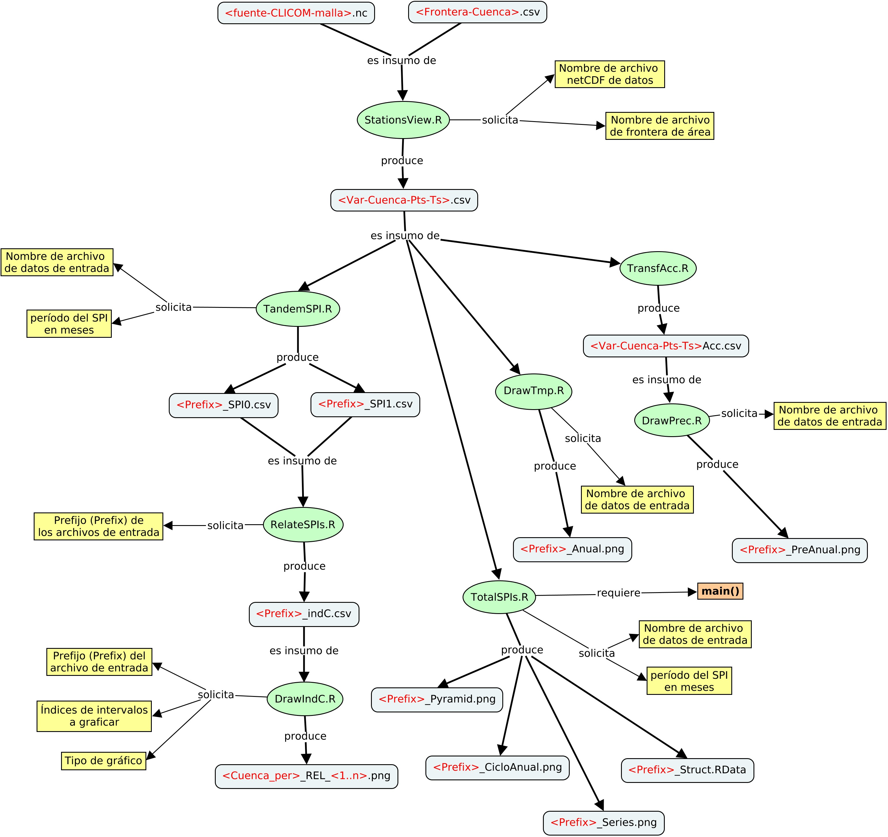

# INTRO
En este documento doy algunas pistas de cómo generar la información del  
proyecto.

# PRODUCCIÓN DE LA INFORMACIÓN
En seguida se muestra el diagrama de flujo de la información, hasta llegar 
a los _mapas_ con la relación de cambio del SPI entre dos períodos para una 
región dada.

**Figura 1.** Flujo de la información (como un mapa conceptual)

